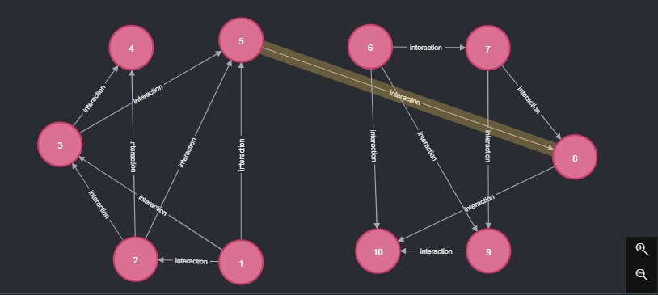

# A MapReduce-Based Parallel Clustering Algorithm
# for Large Protein-Protein Interaction Networks

> Corso di\
> Gestione ed Elaborazione di Big Data\
> \
> Progetto a cura di:\
>   Galang Julian Vincent de Guia\
>   Tatangelo Francesco\
>   Imperatori Giammarco

Lo scopo del nostro progetto è individuare le iterazioni all’interno di un insieme di proteine.\
La rilevazione di queste possibili interazioni è cruciale poiché la rete PPI (protein-protein interaction) è una grande fonte di informazioni, fondamentali per vari studi biologici.

L'approccio è stato quello di considerare questo insieme di proteine e di iterazioni come i nodi e gli archi di un grafo, motivo per cui la scelta di implementare ***Neo4J*** è risultata alquanto naturale.\
\
Dal punto di vista pratico, l'algoritmo visita l'intero grafo, da ogni nodo, determinando quindi le componenti connesse ed in particolare i cammini minimi.
Dalle occorrenze degli archi e dalla grandezza della componente interessata ricaviamo la ***betweenness***, una misura che quantifica il flusso che interessa un determinato arco.
L’arco con la betweenness massima viene eliminato dal grafo.\
Rilevante è il caso in cui quest'operazione restituisca un grafo con un numero di componenti connesse maggiore.\
Per poter scegliere quante componenti considerare, entra in gioco ***Q***, una misura che tiene conto degli archi ancora presenti, confrontandoli con quelli originali.\
***Q*** è il nostro criterio di ottimizzazione.

Il problema è evidentemente un problema di flusso, ma si tratta anche di un problema di clusterizzazione: la ricerca dell'ottimo consiste nel trovare i gruppi di proteine che interagiscono più tra loro separandoli dal resto della rete PPI.

# Dataset
I dataset reali sono disponibili nel sito del [Database of Interacting Proteins](https://dip.doe-mbi.ucla.edu/dip) da cui è tratto in particolare quello da noi utilizzato:
> [***R.Norv***](https://github.com/galang1719565/FinalProjectGEBD/blob/master/Rnorv20170205.txt) - 666 proteine, 619 iterazioni.

Per ottimizzare i risultati, nel grafo abbiamo deciso di eliminare le iterazioni del tipo (a)->(a) e soprattutto abbiamo limitato l’algoritmo a considerare le componenti connesse con un numero di elementi superiore a 10: nel nostro caso il numero di componenti cala drasticamente, da 177 a **15**.

# Classe main:

## *JcomeJava*

***Metodi***:
- ***CreateInput***\
Input: JavaPairRDD di archi;\
Output: File di input n x n.
> NB:  	Struttura di una singola proteina: <NodeId  Root  Neighbors | Distance | Color | Path>\
> Per ogni arco (a,b) vengono generate le coppie (a,lista=<b>) e (b,lista=<a>);\
> Il prodotto cartesiano con tutti i nodi restituisce triplette (nodo, nodo, lista di vicini);\
> Attraverso il reduce step, si ottengono le corrette liste di vicini;\
> I campi mancanti vengono inizializzati con la tripletta (0, "WHITE", null);\
- ***ForwardMR***\
Input: JavaRDD di protein;\
Output: JavaRDD di protein;
> ***ForwardMR***[4];\
> ***Pairing***[5];\
> ***GetNeigh***[6];\
> ***Recontruct***[7];
- ***BackwardMR***\
Input: numero step, file di input della singola componente (esplorato);\
Output: (numero step, lista di archi della componente) , (arco, betweenness) .
> Si considerano tutti gli archi;\
> Si prendono le coppie (arco,1);\
> Attraverso il reduce step si ottengono le coppie (arco, numero di occorrenze);\
> Dividendo per n*(n-1) il valore della coppia, si ottengono (arco, betweenness);\
> ***EdgesComparator***[8] restituisce l’arco con betweenness massima.
- ***ComputeBC***\
Input: lista (step, lista di archi della componente) , (arco, betweenness);\
Output: quartetto (step, lista di archi della componente) , (arco, betweenness).
> ***EdgesComparator***[4] restituisce l’arco con betweenness massima tra quelli con betweenness massima nella propria componente.

### **Algoritmo**:
	
> Data l’onerosità del codice, il numero massimo di iterazioni è impostato a 5.

Lettura del file txt codificato come lista di archi;
Interfaccia Neo4J: creazione del grafo di partenza;\
Lista BC: ad ogni iterazione dell’algoritmo salvo il grafo corrispondente;\
Ciclo while 
> in questo caso la limitazione è dato dal numero massimo di step,\
	altrimenti la procedura prevede l'esaurimento di tutti gli archi
- ***DividiComponentiCheck***[2];
- ***Check***[3]; 
- Per ogni componente connessa:
	- ***CreateInput***;
	> Viene definita la struttura delle proteine[1]
	- Inizializzazione dei nodi dove NodeId=Root -> Color = “GREY”;
	- Ciclo while (finché tutta la componente non viene esplorata)
		- ***ForwardMR***;
	- Calcolo della betweenness attraverso ***BackwardMR***.
- Calcolo della betweenness massima tra tutte le componenti attraverso ***ComputeBC***;
- Eliminazione dell’arco con betweenness massima;
- Aggiungo alla lista BC il risultato ottenuto.

Definisco l’oggetto Q=(step, lista di componenti);\
***ComputeDamnQ***[9];\
***QComparator***[10].

	
	
	

## Altre classi:

### *JcomeToy*
> Applicazione dell'algoritmo ad un dataset di prova.

> Si osservi come sia presente un arco, evidenziato in figura, in cui il flusso è evidentemente concentrato e di conseguenza presenterà una ***betweenness*** elevata.
> Eliminato questo arco, le due componenti connesse ottenute appaiono fortemente connesse. Motivo per il quale ci si aspetta che ulteriori eliminazioni siano superflue: è difatti il grafo ottimo secondo ***Q***.
	
### 1. *Protein*
Si tratta del costruttore.
> < NodeId  Root  Neighbors | Distance | Color | Path >

### 2. *DividiComponentiCheck*
Input: Lista di archi;\
Output: Lista di liste di archi.
> Divisione degli archi in componenti connesse, basata sulla verifica effettuata dal metodo ***check*** (fissato un arco e1=(a,b), questo viene comparato ad un altro arco e2=(c,d): se a o b compare in e2 il metodo ritorna true; altrimenti falso).

### 3. *Check*
Input: Lista di archi;\
Output: Lista di archi.
> Controllo per evitare che ci siano archi che si ripetano.

### 4. *ForwardMR*

> (FlatMapFunction)

Input: Proteina;\
Output: Lista di proteine.
> Per l’esplorazione del grafo.
> Il codice è eseguito solo quando la proteina in questione è di colore GREY:
> - Il nodo viene esaminato;
> - Se esiste, si estrapola il path corrente;
> - Per ogni nodo nella lista dei neighbors:
>   - Si genera la proteina\
	< nodo neighbors corrente, nodo esaminato, null | distanza corrente +1, GREY, path corrente + arco (nodo neigh, nodo esaminato) >;
> - Si genera una nuova proteina a quella di partenza, ma di colore BLACK;

### 5. *Pairing*

> (PairFunction)

Input: Proteine;\
Output: Proteine (destrutturate).
> La struttura monolitica < NodeId  Root  Neighbors | Distance | Color | Path >\
> viene divisa in una coppia < (NodeId  Root), (Neighbors | Distance | Color | Path) >

### 6. *GetNeigh*

> (ReduceByKey)

Input: Proteine (destrutturate: < (NodeId  Root), (Neighbors | Distance | Color | Path) >);\
Output: Proteine (destrutturate).
> Identificate dalla chiave (NodeId, Root), la classe recupera il quartetto di valori delle proteine privilegando quelli generati dalla classe ForwardMR, aggiornati, piuttosto che quelli originali.

### 7. *Recontruct*
Input: Proteine (destrutturate: < (NodeId  Root), (Neighbors | Distance | Color | Path) >);\
Output: Proteine .
> Si torna alla struttura monolitica < NodeId  Root  Neighbors | Distance | Color | Path >.

### 8. *EdgesComparator*

> (Comparator)

Input: coppie (arco, betweenness);\
Output: (arco, betweenness).
> Individuazione della betweenness massima.

### 9. *ComputeDamnQ*
Input: coppie (lista delle componenti, lista di tutti gli archi);\
Output: Grafo = (lista delle componenti, Q).
> Siano E=|{tutti gli archi}|, C=|{componenti connessa}|, costruisco la matrice f dove \
> f [ i ][ j ] =
> - f [ i ][ i ] = numero di archi della componente i / E, se i=j;
> - f [ i ][ j ] = f [ j ][ i ] = damnEdges / E, se i!=j.\
> Calcolo Q attraverso DamnQ.
- ***damnEdges***\
Input: (archi della componente i, archi della componente j, tutti gli archi);\
Output: conteggio.
> Rimozione degli archi delle componenti i e j da tutti gli archi;\
> Conteggio degli archi rimanenti connessi con le due componenti attraverso ***Link***.
- ***Link***\
Input: (arco (a,b), lista della componente i , lista della componente j);\
Output: TRUE se a o b compare in una delle componenti .
- ***DamnQ***\
Input: (numero di componenti, matrice f);\
Output: Q.
> Calcolo di Q.

### 10. *QComparator*

> (Comparator)

Input: coppie (lista delle componenti, Q);\
Output: (lista delle componenti, Q).
> Individuazione della Q massima.

